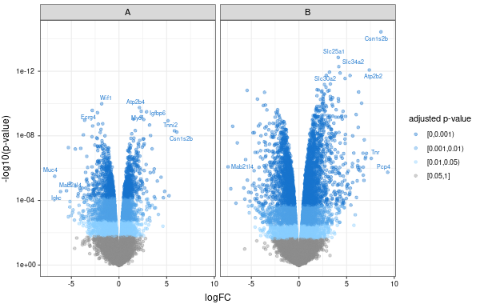
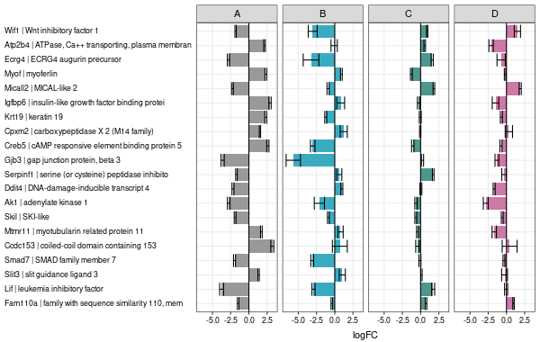
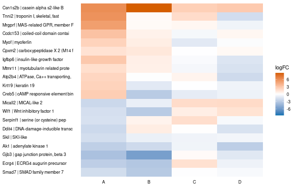
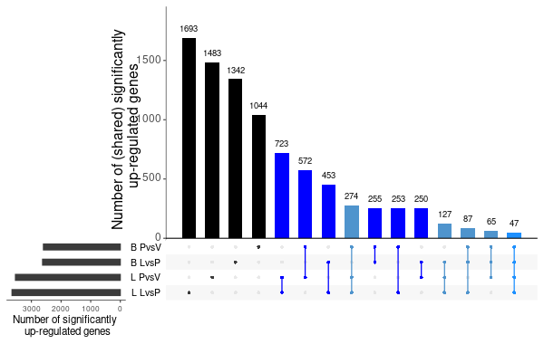
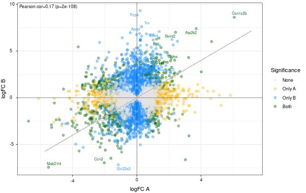
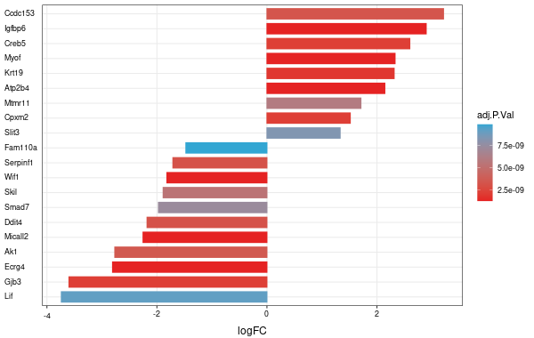
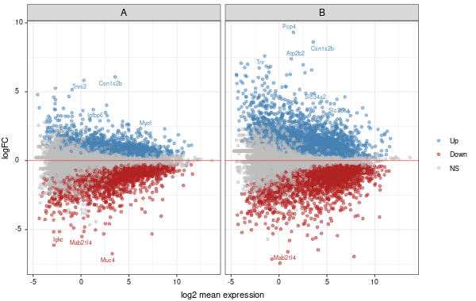
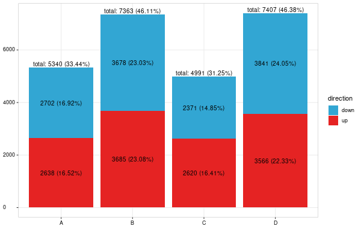

daVis: Visualization of differential expression analysis output
================
Katarzyna Górczak, Laure Cougnaud
2026-01-29

# Introduction

The `daVis` package contains utility functions to visualize the output from 
differential expression analysis. The input data can be a model, a 
list of top tables, or a combination of these two. The model can be of class 
`MArrayLM` (limma), `DGELRT` (edgeR), or `DESeqResults` (DESeq2).

## Installation

### 1\. Download the package from Bioconductor

```r
if (!requireNamespace("BiocManager", quietly = TRUE))
  install.packages("BiocManager")

BiocManager::install("daVis")
```

NOTE: to install development version direct from GitHub:
```r
if (!requireNamespace("devtools", quietly = TRUE))
  install.packages("devtools")

devtools::install_github("openanalytics/daVis")
```

### 2\. Load the package into R session

```r
library(daVis)
```

# Example data

The `createExampleData()` function 
will download and create an example input data for the visualizations. 

More information about the experiment can be found 
[here](https://www.ncbi.nlm.nih.gov/geo/query/acc.cgi?acc=GSE60450).

```r
tmpDir <- tempfile(); dir.create(tmpDir)
exampleData <- createExampleData(path = tmpDir, output = c("limma", "edgeR", "deseq2", "topTable"))
res.limma <- exampleData$limma
res.edger <- exampleData$edgeR
res.deseq <- exampleData$DESeq2
topTableList <- exampleData$topTable
```

# Visualizations

## Volcano plot

The `daVolcanoPlot()` function 
enables a quick visual identification of the size and significance of the 
feature expression effects (top left/right). The significance of the effect is 
represented by the raw p-value on the y axis, so highly significant features 
are at the top of the plot. The size of the effect is represented by the log of 
the fold change (negative/positive for down/up-regulation), so features with 
high effects are at the right/left side of the plot. Below, the color scale 
is used for adjusted p-values (corrected for multiple testing across genes).

```r
coefs <- c("B.LvsP", "L.LvsP")

daVolcanoPlot(input = res.limma, 
              coef = coefs, 
              coefLabel = c("A", "B"),
              facetNCol = 2,
              colorVar = "adj.P.Val",
              topGenes = 5,
              topGenesVar = "SYMBOL")
```



## Log-ratio plot

The `daLogRatioPlot()` function 
represents the differential effect (e.g. treatment versus control) for several 
conditions (e.g., compounds or concentrations) of the experiment (log FC scale). 
This enables to visualize a bigger subset of genes. The significance of genes
can be represented via colored rows, e.g., red denotes significant genes, 
while gray indicates non-significant genes.

```r
coefs <- c("B.LvsP", "L.LvsP", "B.PvsV", "L.PvsV")

daLogRatioPlot(input = res.limma,
               featuresVar = c("SYMBOL", "GENENAME"),
               coef = coefs,
               coefLabel = c("A", "B", "C", "D"),
               facetNCol = 4,
               errorBars = TRUE)
```



## Heatmap

The `daHeatmapLogFC()` function 
represents the differential effect (e.g. treatment versus control) for several 
conditions (e.g., compounds or concentrations) of the experiment. It is a 
graphical representation of the individual values contained in a matrix as 
colors. This enables to visualize a bigger subset of genes. The gene label can 
be colored indicating for example the significance of genes, e.g., black color 
denotes significant genes, while gray represents non-significant genes.

```r
coefs <- c("B.LvsP", "L.LvsP", "B.PvsV", "L.PvsV")

daHeatmapLogFC(input = topTableList,
               featuresIdVar = "ENTREZID",
               featuresVar = c("SYMBOL", "GENENAME"),
               featuresMaxNChar = 35,
               coef = coefs,
               coefLabel = c("A", "B", "C", "D"))
```



## Upset plot

The `daUpset()` function 
is used to represent the overlap (intersection) or difference of the sets of 
significant genes, down or up-regulated separately, between different 
differential effects. The different shades of blue are indicative for the 
number of differential effects (sharing these up- or down-regulated genes).

```r
coefs <- c("B.LvsP", "L.LvsP", "B.PvsV", "L.PvsV")

daUpset(input = topTableList,
        coef = coefs,
        featuresIdVar = "SYMBOL",
        fdr = 0.05,
        dir = "up",
        ylab = paste("Number of (shared) significantly \n", 
                     "up-regulated genes"),
        xlab = paste("Number of significantly \n", 
                     "up-regulated genes"))
```



Get feature identifiers from each overlapping set with `returnAnalysis = TRUE`.

## Scatter plot

The `daScatterPlot()` function 
visualizes the comparison of the logFC for different differential effects.

```r
coefs <- c("B.LvsP", "L.LvsP")

daScatterPlot(input = topTableList,
              coef = coefs,
              coefLabel = c("A", "B"),
              featuresIdVar = "ENTREZID",
              topGenes = 10,
              topGenesVar = "SYMBOL",
              correlation = TRUE)
```



## Waterfall plot

The `daWaterfallPlot()` function 
visualizes the logFC for different differential effects colored by adjusted 
p-value.

```r
daWaterfallPlot(input = res.limma,
                coef = "B.LvsP",
                coefLabel = "A",
                featuresIdVar = "ENTREZID",
                featuresVar = "SYMBOL",
                colorVar = "adj.P.Val",
                color = c("#e52323", "#32a6d3"),
                fillVar = "adj.P.Val",
                fill = c("#e52323", "#32a6d3"),
                typePlot = "static")
```



## MA plot

The `daMAplot()` function 
visualizes the logFC versus log2 mean expression.

```r
coefs <- c("B.LvsP", "L.LvsP")

daMAplot(input = res.limma, 
         coef = coefs, 
         coefLabel = c("A", "B"),
         featuresIdVar = "ENTREZID",
         topGenes = 5,
         topGenesVar = "SYMBOL",
         direction = TRUE, 
         color = c("steelblue", "firebrick", "grey"),
         facetNCol = 2)
```



## Significant genes barplot

The `daSignificantGenesBarplot()` function 
visualizes the number of significant genes per comparison.

```r
coefs <- c("B.LvsP", "L.LvsP", "B.PvsV", "L.PvsV")

daSignificantGenesBarplot(input = res.limma, 
                          coef = coefs, 
                          coefLabel = c("A", "B", "C", "D"),
                          addPercentage = TRUE)
```


